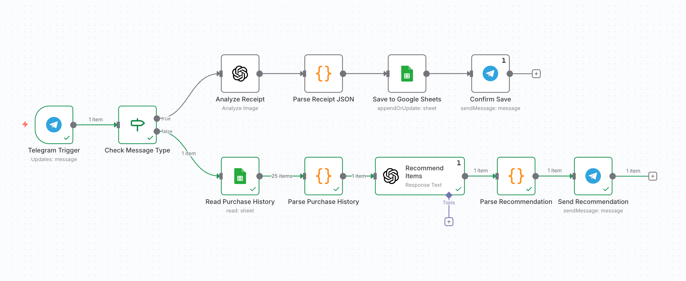

# 🛒 My Grocery Helper

An **AI-powered shopping assistant** built in [n8n](https://n8n.io/).  
It connects **Telegram + OpenAI + Google Sheets** to manage your grocery receipts and generate weekly shopping recommendations.

---

## 🌟 Features
- Send a grocery receipt photo via Telegram  
- OpenAI Vision extracts items & prices  
- Automatically saves parsed data into Google Sheets  
- Analyzes purchase history with GPT-5  
- Replies in Telegram with your weekly shopping list  

---

## 🧩 Workflow Overview

### Flow Summary

| Step | Node | Description |
|------|------|-------------|
| 1 | **Telegram Trigger** | Listens for new messages (photo or text) |
| 2 | **Check Message Type** | Routes image → receipt analysis; text → shopping recommendation |
| 3 | **Analyze Receipt (OpenAI Vision)** | Extracts items and prices from photo |
| 4 | **Parse Receipt JSON** | Cleans and structures extracted data |
| 5 | **Save to Google Sheets** | Appends parsed items to sheet |
| 6 | **Confirm Save** | Replies with “✅ Saved X items” |
| 7 | **Read Purchase History** | Reads previous purchase data |
| 8 | **Parse Purchase History** | Calculates frequency, last purchase date, and intervals |
| 9 | **Recommend Items (GPT-5)** | Predicts what to restock this week |
| 10 | **Parse Recommendation** | Formats the AI output |
| 11 | **Send Recommendation** | Sends summary message back to Telegram |

---

## 💡 Example Conversation
**User:** 发送一张购物小票  
**Bot:** ✅ 已记录 15 件商品并保存至 Google Sheets  

**User:** 购物清单  
**Bot:**  
🛒 本周购物推荐：  
- 牛奶（7天前购买，建议补货）  
- 鸡蛋（常规每周购买）  
- 冷冻西兰花（库存可能不足）  

---

## ⚙️ Tech Stack
- **n8n** – Workflow automation  
- **OpenAI GPT-4o / GPT-5** – Vision + Text reasoning  
- **Google Sheets API** – Persistent storage  
- **Telegram Bot API** – User interaction  

---

## 🚀 Setup Guide (Web Only)
1. **Create a Telegram bot** using [@BotFather](https://t.me/BotFather) → copy your token  
2. **Create a Google Sheet** with columns: `date | name | price`  
3. In **n8n**, import `My Grocery Helper.json`  
4. Connect your credentials:  
   - Telegram  
   - Google Sheets  
   - OpenAI  
5. Activate the workflow → it will auto-run on Telegram messages  

---

## 🧠 Future Enhancements
- [ ] Add weekly scheduler for automatic reminders  
- [ ] Monthly spending summary (Google Charts + Telegram image)  
- [ ] Multi-language responses  

---

## 🪪 License
MIT © 2025 Bessie Wang
